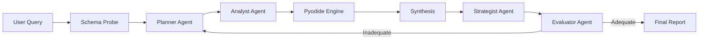

# IPL Strategy Lab 🏏

A next-generation IPL analytics platform powered by Agentic AI (Google Gemini / Gemma 3) and Client-Side Python (Pyodide). Ask complex cricket questions in natural language and get AI-powered insights, visualizations, and professional reports.

[](https://opensource.org/licenses/Apache-2.0)


## ✨ Features

### 🤖 AI Intelligence
- **Multi-Agent Architecture**: Analyst (code) → Strategist (insights) → Evaluator (quality audit)
- **Self-Healing Analysis**: Recursive feedback loop auto-restarts investigation with enhanced prompts if initial response is inadequate
- **Schema-Aware Code Gen**: Probes database structure before coding to prevent runtime errors
- **Real-Time Progress**: Visual progress bar showing agent's current stage (`[2/6] Planning investigation...`)

### 📱 User Experience
- **Mobile Responsive**: Hamburger menu, slide-in sidebar, touch-friendly UI
- **Recent Chats**: Quick access to your 5 most recent queries
- **Model Selection**: Configure any Gemini/Gemma model in Settings
- **PWA Ready**: Install as a native app on any device

### 📊 Data & Visualization
- **Client-Side Python**: Execute Pandas analysis directly in browser via Pyodide (WASM)
- **260k+ Deliveries**: Comprehensive IPL dataset (2008-2024), Gzip optimized
- **Interactive Charts**: Dynamic bar/area charts powered by Recharts
- **PDF Export**: One-click professional report generation

### 🔒 Privacy & Security
- **BYOK**: Bring Your Own Key - API keys stored locally, never sent to servers
- **Zero Server Processing**: All computation happens in your browser

## 🛠️ Tech Stack

| Category | Technologies |
|----------|-------------|
| Framework | React 19, TypeScript, Vite |
| AI | Google Generative AI SDK, Gemini 2.0, Gemma 3 |
| Runtime | Pyodide (Python 3.11 WASM), Pandas |
| Styling | TailwindCSS v4, Shadcn UI, Framer Motion |
| Build | Bun, Husky (pre-commit hooks) |

## 🚀 Getting Started

### Prerequisites
- [Bun](https://bun.sh) (v1.0+)
- Google Gemini API Key ([Get one here](https://aistudio.google.com/))

### Installation

```bash
# Clone the repository
git clone https://github.com/Ayush12358/ipl-analysis.git
cd ipl-analysis

# Install dependencies
bun install
```

### Development

```bash
bun run dev
```

Open http://localhost:5173 and configure your API key in Settings (⚙️).

### Build

```bash
bun run build
```

## 🏗️ Architecture



## 📝 License

Licensed under the Apache License, Version 2.0. See [LICENSE](LICENSE) for details.

Copyright 2026 Ayush Maurya
